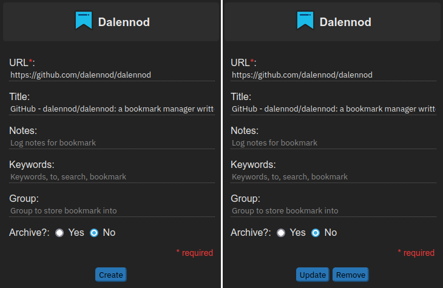
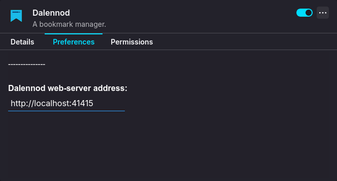

# Dalennod's extension

Dalennod's web extension for Firefox and Chromium browsers.

### Features:

- Create, update and delete bookmarks directly from the extension
- Navigate to Web UI by clicking on 'Dalennod' text on top
- Auto-completion of words in 'Keywords' field for quicker input
- Refresh a bookmark's thumbnail that is shown in the Web UI
- Options page to change web-server URL to connect to if non-default settings are used

### Screenshot:

#### Browser Extension:

#### Options Page:

