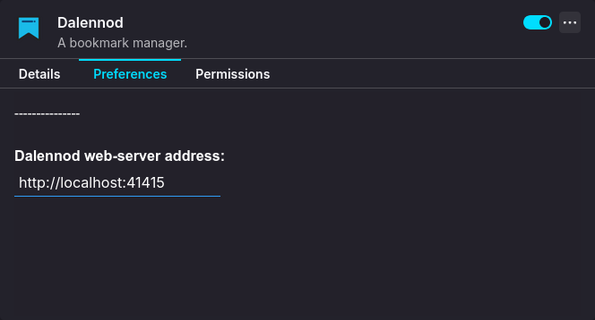

# Dalennod's extension

Dalennod's web extension for Firefox and Chromium browsers.

## Features:

- Create, update and delete bookmarks directly from the extension.
- Easily navigate to Web Interface by clicking on 'Dalennod' text on top.
- Auto-completion of words in 'Keywords' field.
- Refresh a bookmark's thumbnail that is shown in the Web Interface.
- Options page to change web-server URL to connect to if non-default settings are used.

## Screenshot:

### Browser Extension:

### Options Page:

